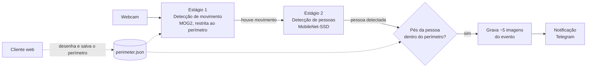

# Safeguard — Estado do Projeto

Documento de referência do time para o projeto da disciplina Tópicos Especiais em Computação (Prof. Felipe dos Anjos). Ele descreve o que já existe, o que falta, quais tecnologias usamos e como o código está organizado. Atualize a seção de estado sempre que um módulo mudar de situação.

**Última atualização:** 07/10/2026. O estado dos módulos é o dos últimos testes registrados com webcam real.

Documentos relacionados: `docs/CONTEXTO_SAFEGUARD.md` (histórico e decisões, para continuar o projeto em outros chats) e `docs/INSTALACAO_RASPBERRY_PI.md` (instalação no Pi).

---

## 1. Visão geral

O Safeguard é um sistema cliente-servidor de vigilância de perímetro. Uma câmera observa uma área, o usuário desenha sobre a imagem a região que quer vigiar (que pode ser só uma parte da imagem ou ela inteira), e o sistema avisa pelo Telegram quando uma **pessoa** entra nessa região. Animais e outros objetos são ignorados.

O servidor roda em um Raspberry Pi 3, que concentra a câmera, o processamento de visão computacional e a API. O cliente é uma página web simples, acessada pelo navegador de qualquer dispositivo na mesma rede, usada para ver a câmera e desenhar o perímetro.

O sistema não usa sensores físicos além da câmera: o gatilho de movimento é feito inteiramente em software, a partir da própria imagem.

---

## 2. Arquitetura

O processamento é dividido em dois estágios para caber no poder de processamento do Raspberry Pi 3. O primeiro estágio é leve e roda o tempo todo; o segundo é pesado e só roda quando o primeiro detecta algo.



**Estágio 1 — movimento.** A subtração de fundo (MOG2, do OpenCV) compara cada frame com um modelo da cena parada. A comparação é aplicada apenas dentro de uma máscara com o formato do perímetro, então movimento fora da área vigiada é ignorado desde o início. Regiões muito pequenas são descartadas como ruído.

**Estágio 2 — pessoas.** Quando há movimento, o frame passa por uma rede neural pré-treinada (MobileNet-SSD) que localiza objetos e os classifica. Só as detecções da classe "pessoa" acima de um limiar de confiança seguem adiante.

**Decisão.** Para cada pessoa, o sistema pega o ponto central da base da caixa detectada (uma aproximação da posição dos pés) e testa se ele está dentro do polígono do perímetro.

**Evento.** Se estiver dentro, o sistema grava cerca de 5 imagens em sequência e, futuramente, as envia pelo Telegram. Um intervalo de espera (cooldown) de 60 segundos impede que a mesma invasão gere várias notificações seguidas.

**Perímetro.** Os pontos do polígono são salvos em `server/data/perimeter.json` em coordenadas normalizadas, ou seja, como frações de 0.0 a 1.0 da largura e da altura da imagem. Isso permite que o perímetro desenhado em uma resolução (no navegador) funcione corretamente em outra (na inferência). Se o arquivo não existir ou estiver inválido, o sistema vigia a imagem inteira.

---

## 3. Tecnologias

| Camada | Tecnologia | Situação |
|---|---|---|
| Linguagem | Python 3.11 / 3.12 | Em uso |
| Visão computacional | OpenCV **4.x** (`opencv-python` pelo pip no computador de desenvolvimento; `python3-opencv` pelo apt no Pi) | Em uso |
| Detecção de movimento | `cv2.createBackgroundSubtractorMOG2` | Em uso |
| Detecção de pessoas | MobileNet-SSD (formato Caffe, 21 classes do dataset VOC) via `cv2.dnn` | Em uso |
| Geometria do perímetro | `cv2.pointPolygonTest`, `cv2.fillPoly` | Em uso |
| Cálculo numérico | NumPy | Em uso |
| Configuração | `python-dotenv` (variáveis em `.env`) | Em uso |
| Servidor web / API | Flask + Flask-SocketIO | Planejado |
| Streaming de vídeo | MJPEG via Flask | Planejado |
| Notificação | Bot API do Telegram, chamada com `requests` | Planejado |
| Cliente | HTML, CSS e JavaScript puro, com `<canvas>` para desenhar o perímetro | Planejado |
| Tempo real no cliente | Socket.IO (cliente JavaScript) | Planejado |
| Hardware do servidor | Raspberry Pi 3 com Raspberry Pi OS | Configurado, ainda sem o código instalado |
| Câmera | Webcam USB | Em uso |
| Versionamento | Git + GitHub (`MateusSant1/safeguard`) | Em uso |

Sobre a versão do OpenCV: o OpenCV 5.0 removeu o suporte a modelos Caffe, que é o formato do MobileNet-SSD que usamos. Por isso o `requirements.txt` fixa a versão abaixo de 5. Instalar o OpenCV sem essa restrição faz o `object_detector.py` falhar com o erro `module 'cv2.dnn' has no attribute 'readNetFromCaffe'`.

---

## 4. Estado atual

| Módulo | Situação | Como foi verificado |
|---|---|---|
| `camera.py` | Funcional | Webcam real (`test_integration.py`) |
| `perimeter.py` | Funcional isoladamente | Webcam real com perímetro de teste desenhado (`test_integration.py`) |
| `motion_detector.py` | Funcional | Webcam real, com e sem máscara do perímetro (`test_motion.py`) |
| `object_detector.py` | Detecta pessoas com limiar 0.26 | Webcam real (`test_object.py`) |
| Perímetro + detecção de pessoas | **Não funcional** | Ver problema 1 |
| `event_recorder.py` | Passou em teste sintético, **não captura no pipeline real** | Ver problema 2 |
| `app.py` | Esqueleto (apenas TODOs) | — |
| `notifier.py` | Esqueleto (apenas TODOs) | — |
| `client/` | Esqueleto (apenas TODOs) | — |

### Problemas conhecidos

**1. O teste do perímetro não corresponde à posição real da pessoa.** Com o limiar de confiança baixo, o modelo muitas vezes enquadra só a parte de cima do corpo (cabeça e tronco). Como o ponto testado contra o perímetro é a base da caixa, ele acaba na altura do pescoço ou do peito, e não dos pés. A hipótese ainda precisa ser confirmada: o próximo passo é desenhar a caixa e o ponto no `test_object.py` e observar onde eles caem em relação ao polígono. Se for isso, as alternativas são testar o centro da caixa ou verificar se a caixa inteira intersecta o polígono.

**2. O `event_recorder` não chega a gravar no pipeline.** No `test_pipeline.py`, ele só é chamado quando existe movimento e uma pessoa com o ponto dentro do perímetro no mesmo frame. Se o problema 1 impede essa condição, o gravador nunca é acionado, o que indicaria que ele próprio não tem defeito. Para isolar, basta abrir a câmera e chamar `EventRecorder().capture_event(cam)` diretamente, conferindo se as imagens aparecem em `server/events/`.

**3. Limitações do modelo.** O MobileNet-SSD é de 2017 e foi treinado em um conjunto de dados pequeno. Ele perde a detecção em movimentos bruscos (por causa do desfoque) e depende bastante de a pessoa estar de frente e bem enquadrada. O detector também não faz rastreamento: cada frame é analisado do zero. Isso é aceitável para o escopo do projeto, e a troca por um modelo mais moderno (YOLO exportado para ONNX) fica registrada como possível melhoria.

---

## 5. Estrutura de pastas

```
safeguard/
├── CLAUDE.md               # contexto do projeto para o Claude Code
├── ESTADO_DO_PROJETO.md    # este documento
├── README.md
├── requirements.txt        # dependências do computador de desenvolvimento (OpenCV < 5)
├── requirements-pi.txt     # dependências pip do Raspberry Pi (OpenCV/NumPy vêm do apt)
├── .env.example            # modelo das variáveis de ambiente
├── .gitignore
├── .gitattributes
│
├── docs/
│   ├── CONTEXTO_SAFEGUARD.md       # contexto completo para novos chats
│   └── INSTALACAO_RASPBERRY_PI.md  # instalação no Pi, passo a passo
├── scripts/
│   ├── setup_raspberry_pi.sh       # instala tudo no Pi
│   └── verificar_ambiente.py       # confere OpenCV, modelo e bibliotecas
│
├── server/                 # roda no Raspberry Pi
│   ├── __init__.py
│   ├── config.py           # lê o .env e centraliza caminhos e constantes
│   ├── camera.py           # único ponto de acesso à webcam
│   ├── perimeter.py        # salva, carrega e testa o polígono do perímetro
│   ├── motion_detector.py  # estágio 1: movimento (MOG2)
│   ├── object_detector.py  # estágio 2: pessoas (MobileNet-SSD)
│   ├── event_recorder.py   # grava as ~5 imagens de um evento
│   ├── notifier.py         # envio ao Telegram (esqueleto)
│   ├── app.py              # servidor Flask e loop principal (esqueleto)
│   │
│   ├── list_cameras.py     # diagnóstico: descobre o índice da webcam
│   ├── test_camera.py      # diagnóstico: confirma que a câmera abre
│   ├── test_integration.py # teste manual: câmera + perímetro
│   ├── test_motion.py      # teste manual ao vivo: movimento
│   ├── test_object.py      # teste manual ao vivo: detecção de pessoas
│   ├── test_pipeline.py    # teste manual ao vivo: pipeline completo sem Telegram
│   │
│   ├── models/             # MobileNetSSD_deploy.prototxt e .caffemodel (~22 MB)
│   ├── data/               # perimeter.json
│   └── events/             # imagens das invasões (ignorado pelo Git)
│
└── client/                 # interface web (esqueleto)
    ├── index.html          # câmera + canvas do perímetro + histórico
    ├── style.css
    ├── perimeter.js        # desenho do polígono e envio dos pontos normalizados
    └── events.js           # histórico de eventos em tempo real
```

Nenhum módulo além de `camera.py` deve abrir a câmera diretamente, para que trocar a webcam pela câmera do Raspberry Pi exija mudança em um arquivo só.

Até 07/10/2026, todos os arquivos de código da `main` no GitHub estavam **vazios (0 bytes)**, inclusive um `server/data/perimeter.json` vazio, que é o que gerava o aviso "Arquivo de perímetro inválido". Em 07/10 o código foi enviado para a branch **`pipeline-raspberry`**. Até ela ser mesclada na `main`, clone com `git clone -b pipeline-raspberry https://github.com/MateusSant1/safeguard.git`.

---

## 6. Como rodar

### Preparação (Windows)

```powershell
python -m venv .venv
.\.venv\Scripts\Activate.ps1
pip install -r requirements.txt
python scripts/verificar_ambiente.py
```

Se o PowerShell bloquear a ativação do ambiente virtual, rode uma vez `Set-ExecutionPolicy -Scope CurrentUser RemoteSigned`.

### Modelo de detecção

Os dois arquivos precisam vir da **mesma fonte**. Arquivos de repositórios diferentes são incompatíveis entre si e causam o erro `blobs.size() >= 2`.

```powershell
$base = "https://github.com/PINTO0309/MobileNet-SSD-RealSense/raw/refs/heads/master/caffemodel/MobileNetSSD"
Invoke-WebRequest -Uri "$base/MobileNetSSD_deploy.prototxt"   -OutFile "server\models\MobileNetSSD_deploy.prototxt"
Invoke-WebRequest -Uri "$base/MobileNetSSD_deploy.caffemodel" -OutFile "server\models\MobileNetSSD_deploy.caffemodel"
```

O `.caffemodel` deve ter cerca de 22 MB.

### Testes manuais

Todos os scripts são executados **da raiz do projeto** e **como módulo** (com `-m` e ponto no lugar da barra). Rodar como arquivo (`python server/test_motion.py`) quebra os imports do pacote `server`.

```powershell
python server/list_cameras.py          # descobrir o índice da webcam
python -m server.test_integration      # câmera + perímetro, gera test_perimetro.jpg
python -m server.test_motion           # movimento ao vivo ('m' alterna modo, 'q' sai)
python -m server.test_object           # pessoas ao vivo
python -m server.test_pipeline         # pipeline completo, sem Telegram
```

Para criar um perímetro de teste sem a interface web, gere o JSON pelo .NET, que não grava o BOM que o `Out-File` do PowerShell adiciona:

```powershell
[System.IO.File]::WriteAllText("server\data\perimeter.json", '{"pontos": [[0.25, 0.25], [0.75, 0.25], [0.75, 0.75], [0.25, 0.75]]}')
```

---

## 7. Configuração

As variáveis de ambiente ficam no arquivo `.env` (copiado de `.env.example` e nunca enviado ao Git):

| Variável | Uso |
|---|---|
| `CAMERA_INDEX` | Índice da webcam (padrão 0) |
| `TELEGRAM_BOT_TOKEN` | Token do bot, gerado pelo @BotFather |
| `TELEGRAM_CHAT_ID` | Chat que recebe as notificações |

Os parâmetros ajustáveis do pipeline, com os valores em uso:

| Parâmetro | Valor | Onde está hoje |
|---|---|---|
| Limiar de confiança para pessoas | 0.26 | `test_object.py`, `test_pipeline.py` |
| Área mínima de movimento | 500 px | `test_motion.py`, `test_pipeline.py` |
| Frames de aquecimento do MOG2 | 30 | scripts de teste |
| Imagens por evento | 5 | `config.py` |
| Cooldown entre eventos | 60 s | `config.py` |

Os dois primeiros ainda estão repetidos nos scripts de teste e devem ser movidos para o `config.py`.

---

## 8. Próximos passos

| Ordem | Tarefa |
|---|---|
| 1 | Confirmar e corrigir o problema do ponto testado contra o perímetro (problema 1) |
| 2 | Confirmar que o `event_recorder` grava quando chamado diretamente (problema 2) |
| 3 | Centralizar os limiares no `config.py` |
| 4 | Implementar o `app.py`: rotas `/snapshot`, `/video_feed`, `/api/perimetro`, `/api/eventos` e o loop do pipeline em uma thread separada |
| 5 | Implementar o cliente: canvas para desenhar o perímetro, enviando pontos normalizados |
| 6 | Criar o bot no Telegram e implementar o `notifier.py` |
| 7 | Instalar e testar no Raspberry Pi 3 com `scripts/setup_raspberry_pi.sh` (ver `docs/INSTALACAO_RASPBERRY_PI.md`) |
