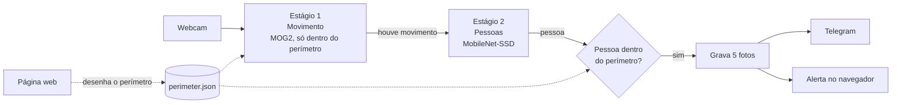

# Safeguard — Vigilância de perímetro com Raspberry Pi

Sistema de vigilância que usa uma webcam comum para detectar **pessoas** entrando em uma área desenhada pelo usuário sobre a imagem da câmera, e avisa pelo **Telegram** com fotos da invasão. Animais e outros movimentos são ignorados.

Projeto da disciplina Tópicos Especiais em Computação (Prof. Felipe dos Anjos).

- O servidor roda em um **Raspberry Pi 3** com uma webcam USB. Não há sensores além da câmera: todo o processamento é feito em software.
- O cliente é uma **página web**, acessada pelo navegador de qualquer dispositivo na mesma rede. Nela você vê a câmera ao vivo, desenha o perímetro e acompanha o histórico de invasões.
- Cada invasão gera **5 fotos** com 1 s de intervalo, enviadas como álbum para um chat do Telegram.

---

## Sumário

1. [Como funciona](#como-funciona)
2. [O que você precisa](#o-que-você-precisa)
3. [Instalação no Raspberry Pi, do zero](#instalação-no-raspberry-pi-do-zero)
4. [Usando o sistema](#usando-o-sistema)
5. [Rodando no computador (desenvolvimento)](#rodando-no-computador-desenvolvimento)
6. [Configuração](#configuração)
7. [Estrutura do projeto](#estrutura-do-projeto)
8. [Problemas comuns](#problemas-comuns)
9. [Estado do projeto](#estado-do-projeto)

---

## Como funciona

O Raspberry Pi 3 não tem capacidade para rodar uma rede neural em todos os frames do vídeo. Por isso o processamento é dividido em dois estágios: um barato que roda o tempo todo, e um caro que só roda quando o primeiro encontra algo.



1. **Movimento (estágio 1).** A subtração de fundo MOG2 do OpenCV compara cada frame com um modelo da cena parada, só dentro da área do perímetro. Regiões pequenas demais são descartadas como ruído.
2. **Pessoas (estágio 2).** Quando há movimento, o frame passa pela rede neural **MobileNet-SSD**, que localiza e classifica objetos. Só a classe `person` pode gerar alarme. Animais (cão, gato, pássaro, cavalo, ovelha, vaca) aparecem no vídeo como "ignorado".
3. **Decisão.** A pessoa está **dentro** quando pelo menos 15% da caixa detectada cai dentro do polígono do perímetro.
4. **Evento.** O sistema grava 5 fotos, a primeira sendo o próprio frame da detecção, e as envia ao Telegram. Durante os 60 s seguintes (cooldown), novas detecções não geram outro alerta.

O perímetro é salvo em coordenadas **normalizadas** (frações de 0 a 1 da largura e da altura da imagem). Assim, o polígono desenhado no navegador vale em qualquer resolução de câmera. Sem perímetro salvo, o sistema vigia a imagem inteira.

---

## O que você precisa

| Item | Observação |
|---|---|
| Raspberry Pi 3 (B ou B+) | Também funciona em modelos mais novos |
| Cartão microSD de 16 GB ou mais | Classe 10 / A1 |
| Fonte 5 V / 2,5 A | Fontes fracas fazem o Pi travar sob carga |
| Webcam USB | Qualquer webcam compatível com Linux (UVC) |
| Rede Wi-Fi ou cabo | O Pi, o computador e o celular precisam estar na mesma rede |
| Computador com leitor de cartão | Para gravar o sistema e acessar o Pi por SSH |
| Conta no Telegram | Para receber os alertas |

---

## Instalação no Raspberry Pi, do zero

> O guia detalhado, com a instalação comando a comando e mais soluções de problemas, está em [`docs/INSTALACAO_RASPBERRY_PI.md`](docs/INSTALACAO_RASPBERRY_PI.md).

### 1. Gravar o sistema no cartão

1. No computador, instale o **Raspberry Pi Imager** (https://www.raspberrypi.com/software/).
2. Escolha o dispositivo **Raspberry Pi 3**, o sistema **Raspberry Pi OS Lite** (Bookworm ou mais novo; a versão Lite basta, porque o sistema é usado pelo navegador) e o cartão.
3. Em **Editar configurações** (o ícone de engrenagem ou "Personalizar"):
   - defina o **nome do host** (ex.: `raspberrypi`), um **usuário** e uma **senha**;
   - configure o **Wi-Fi** (nome e senha da rede), se não for usar cabo;
   - na aba **Serviços**, ative o **SSH** com autenticação por senha.
4. Grave o cartão, coloque-o no Pi, conecte a **webcam** e ligue a fonte. A primeira inicialização leva alguns minutos.

### 2. Acessar o Pi pelo SSH

No terminal do computador (PowerShell no Windows), troque `usuario` pelo usuário que você criou:

```bash
ssh usuario@raspberrypi.local
```

Se `raspberrypi.local` não responder, procure o IP do Pi na lista de dispositivos do roteador e use `ssh usuario@<IP>`.

Já dentro do Pi, confira se a webcam foi reconhecida:

```bash
lsusb                  # a webcam deve aparecer na lista
ls /dev/video*         # /dev/video0 = câmera reconhecida
```

### 3. Baixar o projeto e instalar tudo

```bash
sudo apt update && sudo apt install -y git
cd ~
git clone https://github.com/MateusSant1/safeguard.git
cd safeguard
bash scripts/setup_raspberry_pi.sh
```

Rode o script como seu usuário normal, **sem `sudo`**; ele pede a senha quando precisa. A primeira execução leva de 10 a 30 minutos. O script:

1. atualiza o sistema;
2. instala o OpenCV 4 e o NumPy pelo `apt`, já compilados para o processador do Pi;
3. cria o ambiente virtual `.venv` e instala as bibliotecas Python (`requirements-pi.txt`);
4. baixa o modelo MobileNet-SSD (~22 MB);
5. cria o arquivo `.env` e dá ao seu usuário acesso à câmera;
6. termina rodando uma verificação, que deve mostrar **"Ambiente pronto"**.

Se o script avisar que seu usuário foi adicionado ao grupo `video`, saia (`exit`) e entre de novo no SSH antes de continuar.

> **Não rode `pip install -r requirements.txt` no Pi.** Esse arquivo é do computador de desenvolvimento e instalaria um OpenCV incompatível por cima do que veio do `apt`.

### 4. Conferir o índice da câmera

```bash
cd ~/safeguard
source .venv/bin/activate
python server/list_cameras.py
```

O script lista as câmeras que abrem e salva uma foto de cada uma (`camera_N.jpg`). Muitas webcams criam dois dispositivos; normalmente a imagem está no de número menor. Se não for o índice `0`, ajuste `CAMERA_INDEX` no `.env` (veja o próximo passo).

### 5. Criar o bot do Telegram

1. No Telegram, abra o **@BotFather**, envie `/newbot` e siga as instruções. No fim ele mostra o **token** do bot.
2. Abra o `.env` no Pi e cole o token:
   ```bash
   nano .env
   ```
   ```
   TELEGRAM_BOT_TOKEN=123456789:AAH...
   TELEGRAM_CHAT_ID=
   CAMERA_INDEX=0
   ```
   No `nano`, salve com `Ctrl+O`, `Enter`, e saia com `Ctrl+X`.
3. No Telegram, mande qualquer mensagem (ex.: `oi`) para o seu bot.
4. No Pi, descubra o id do chat:
   ```bash
   python -m server.test_telegram
   ```
   Ele mostra uma linha como `TELEGRAM_CHAT_ID=987654321`. Copie para o `.env`. Para receber os alertas num **grupo**, adicione o bot ao grupo, mande uma mensagem lá e rode o script de novo; o id do grupo começa com `-`.
5. Rode o mesmo comando mais uma vez: ele envia uma mensagem de teste para o chat.

O token dá controle total do bot: nunca o coloque no Git nem o compartilhe. O `.env` já é ignorado pelo Git.

### 6. Iniciar o sistema

```bash
cd ~/safeguard
source .venv/bin/activate
python -m server.app
```

Fique **fora do enquadramento** enquanto o sistema inicia: nos primeiros frames ele aprende como é a cena vazia. Quando o log mostrar `Pipeline iniciado` e `Running on http://...:5000`, descubra o IP do Pi:

```bash
hostname -I
```

e abra **`http://<IP do Pi>:5000`** no navegador do computador ou do celular, na mesma rede. Para parar o servidor, use `Ctrl+C`.

### 7. (Opcional) Iniciar sozinho ao ligar o Pi

Para o Safeguard subir automaticamente a cada boot, crie um serviço do systemd:

```bash
sudo tee /etc/systemd/system/safeguard.service > /dev/null <<EOF
[Unit]
Description=Safeguard - vigilancia de perimetro
After=network-online.target
Wants=network-online.target

[Service]
User=$USER
WorkingDirectory=$HOME/safeguard
ExecStart=$HOME/safeguard/.venv/bin/python -m server.app
Restart=on-failure
RestartSec=5
Environment=PYTHONUNBUFFERED=1

[Install]
WantedBy=multi-user.target
EOF

sudo systemctl daemon-reload
sudo systemctl enable --now safeguard
```

Comandos úteis:

```bash
systemctl status safeguard        # está rodando?
journalctl -u safeguard -f        # log ao vivo (Ctrl+C para sair)
sudo systemctl restart safeguard  # reinicia (ex.: depois de mudar o .env)
sudo systemctl disable --now safeguard   # desliga o início automático
```

Com o serviço ativo, não rode `python -m server.app` manualmente ao mesmo tempo: os dois disputariam a câmera.

### 8. Atualizar depois de mudanças no código

```bash
cd ~/safeguard
git pull
SKIP_UPGRADE=1 bash scripts/setup_raspberry_pi.sh
sudo systemctl restart safeguard   # só se estiver usando o serviço
```

---

## Usando o sistema

Abra `http://<IP do servidor>:5000`. A página tem três partes.

### Monitoramento ao vivo

O vídeo mostra o que cada estágio está vendo:

| No vídeo | Significado |
|---|---|
| Pixels em **amarelo** | Movimento detectado dentro do perímetro (estágio 1) |
| Caixa **vermelha** | Pessoa **dentro** do perímetro: dispara o alerta |
| Caixa **verde** | Pessoa fora do perímetro |
| Caixa **cinza** "ignorado" | Animal detectado: nunca dispara alerta |
| `person 0.62 overlap=0.31` | Confiança da detecção e fração da caixa dentro do perímetro |
| `MOVIMENTO area=2300px (min 500)` | Estado do estágio 1 |
| `[gravando evento]` / `(cooldown: 42s)` | Evento sendo gravado / tempo até poder alertar de novo |

O selo no topo da página mostra se o sistema está **Monitorando** e o cooldown.

### Perímetro

1. Clique em **Limpar**.
2. Clique sobre a imagem para marcar os vértices da área a vigiar (no mínimo 3). Arraste um vértice para movê-lo; clique com o botão direito sobre ele para removê-lo.
3. Clique em **Salvar perímetro**. A área passa a valer na hora, sem reiniciar.

**Imagem inteira** volta a vigiar o frame todo. **Atualizar imagem** busca uma foto nova da câmera para servir de referência.

Dica: para testar, a pessoa precisa estar **inteira de um lado da linha**. De perto da câmera, o corpo ocupa metade da tela e a caixa sempre terá parte dentro do perímetro.

### Histórico

Lista os eventos mais recentes com as 5 fotos (clique para ampliar). A cada nova invasão, um aviso vermelho aparece no topo da página, ao mesmo tempo que o álbum chega no Telegram. As fotos ficam salvas no servidor em `server/events/<data_hora>/`.

---

## Rodando no computador (desenvolvimento)

Funciona em Windows, Linux ou macOS, com Python 3.11 ou mais novo e uma webcam.

```powershell
git clone https://github.com/MateusSant1/safeguard.git
cd safeguard
python -m venv .venv
.\.venv\Scripts\Activate.ps1          # Linux/macOS: source .venv/bin/activate
pip install -r requirements.txt
```

Baixe o modelo. Os dois arquivos precisam vir da **mesma fonte**:

```powershell
$base = "https://github.com/PINTO0309/MobileNet-SSD-RealSense/raw/refs/heads/master/caffemodel/MobileNetSSD"
Invoke-WebRequest -Uri "$base/MobileNetSSD_deploy.prototxt"   -OutFile "server\models\MobileNetSSD_deploy.prototxt"
Invoke-WebRequest -Uri "$base/MobileNetSSD_deploy.caffemodel" -OutFile "server\models\MobileNetSSD_deploy.caffemodel"
```

Configure e rode:

```powershell
Copy-Item .env.example .env            # preencha o Telegram (passo 5 acima)
python scripts/verificar_ambiente.py   # deve terminar com "Ambiente pronto"
python -m server.app                   # http://localhost:5000
```

Rode tudo **da raiz do projeto** e **como módulo** (`python -m server.app`, e não `python server/app.py`); senão os imports do pacote `server` falham. Se o PowerShell bloquear a ativação do `.venv`, rode uma vez `Set-ExecutionPolicy -Scope CurrentUser RemoteSigned`.

Scripts de teste manual (abrem uma janela com o vídeo, então não funcionam pelo SSH):

```powershell
python -m server.test_motion      # só o estágio 1
python -m server.test_object      # só a detecção de pessoas
python -m server.test_pipeline    # pipeline completo, sem servidor web nem Telegram
python -m server.test_telegram    # Telegram, sem câmera
```

---

## Configuração

Tudo fica no arquivo `.env`, criado a partir do [`.env.example`](.env.example). Só o Telegram é obrigatório; o resto tem valor padrão.

| Variável | Padrão | Para quê |
|---|---|---|
| `TELEGRAM_BOT_TOKEN` | — | Token do bot, gerado pelo @BotFather |
| `TELEGRAM_CHAT_ID` | — | Chat (ou grupo) que recebe os alertas |
| `CAMERA_INDEX` | `0` | Índice da webcam |
| `CONFIDENCE_THRESHOLD` | `0.26` | Confiança mínima para aceitar uma pessoa |
| `MOTION_THRESHOLD_AREA` | `500` | Área mínima de movimento (px) para acionar a rede neural |
| `MIN_OVERLAP_RATIO` | `0.15` | Fração da caixa da pessoa que precisa estar dentro do perímetro |
| `DECISION_MODE` | `overlap` | Critério dentro/fora: `overlap`, `center` (centro da caixa) ou `foot` (base da caixa) |
| `EVENT_FRAME_INTERVAL_SECONDS` | `1.0` | Intervalo entre as 5 fotos de um evento |
| `NOTIFICATION_COOLDOWN_SECONDS` | `60` | Espera mínima entre dois alertas |
| `WARM_UP_FRAMES` | `30` | Frames para aprender a cena vazia ao iniciar |
| `TELEGRAM_FORCE_IPV4` | `1` | Fala com o Telegram só por IPv4 (redes com IPv6 quebrado davam timeout) |
| `SERVER_HOST` / `SERVER_PORT` | `0.0.0.0` / `5000` | Endereço do servidor web |
| `JPEG_QUALITY` | `80` | Qualidade do vídeo enviado ao navegador |

Depois de mudar o `.env`, reinicie o servidor.

### API

| Rota | Descrição |
|---|---|
| `GET /` | Página web |
| `GET /video_feed` | Vídeo ao vivo anotado (MJPEG) |
| `GET /snapshot` | Um frame da câmera, sem anotações (JPEG) |
| `GET /api/perimetro` | Perímetro salvo: `{"pontos": [[x, y], ...]}`, normalizado |
| `POST /api/perimetro` | Salva um perímetro: `{"pontos": [[x, y], ...]}`, no mínimo 3 pontos entre 0 e 1 |
| `GET /api/eventos` | Histórico de eventos (os mais recentes primeiro) |
| `GET /api/status` | Estado do pipeline, cooldown e último evento |
| Socket.IO `intrusao` | Emitido a cada invasão confirmada |

---

## Estrutura do projeto

```
safeguard/
├── server/                    # roda no Raspberry Pi
│   ├── app.py                 # servidor web (Flask + Socket.IO) — ponto de entrada
│   ├── pipeline.py            # loop principal em thread: câmera → movimento → pessoas → evento
│   ├── camera.py              # único módulo que acessa a webcam
│   ├── motion_detector.py     # estágio 1: movimento (MOG2)
│   ├── object_detector.py     # estágio 2: pessoas e animais (MobileNet-SSD)
│   ├── perimeter.py           # salva, carrega e testa o polígono
│   ├── event_recorder.py      # grava as fotos de cada evento
│   ├── notifier.py            # envio ao Telegram
│   ├── config.py              # lê o .env e centraliza as constantes
│   ├── list_cameras.py, test_*.py   # diagnóstico e testes manuais
│   ├── models/                # modelo MobileNet-SSD (baixado na instalação)
│   ├── data/perimeter.json    # perímetro salvo (criado pela página web)
│   └── events/                # fotos das invasões
├── client/                    # página web (HTML, CSS e JavaScript puro)
├── scripts/
│   ├── setup_raspberry_pi.sh  # instalação completa no Pi
│   └── verificar_ambiente.py  # confere OpenCV, modelo e bibliotecas
├── docs/                      # instalação detalhada e histórico do projeto
├── requirements.txt           # dependências do computador de desenvolvimento
├── requirements-pi.txt        # dependências pip do Pi (OpenCV e NumPy vêm do apt)
└── .env.example               # modelo de configuração
```

**Tecnologias:** Python 3, OpenCV 4 (MOG2 e `cv2.dnn`), MobileNet-SSD (Caffe, classes do PASCAL VOC), NumPy, Flask, Flask-SocketIO, Bot API do Telegram e HTML/CSS/JavaScript com `<canvas>`.

O OpenCV precisa ser da versão **4.x**: o OpenCV 5 removeu o suporte a modelos Caffe, que é o formato do MobileNet-SSD usado aqui.

---

## Problemas comuns

| Sintoma | Solução |
|---|---|
| "Não foi possível abrir a câmera" | Confira `ls /dev/video*`, rode `python server/list_cameras.py` e ajuste `CAMERA_INDEX`. No Pi, o usuário precisa estar no grupo `video` (saia e entre no SSH depois do script de instalação). |
| A página não abre de outro dispositivo | Use o IP do servidor (`hostname -I` no Pi), não `localhost`, e confira se os dois estão na mesma rede. No Windows, libere o Python no firewall. |
| Toda pessoa conta como "dentro" | A pessoa está cruzando a linha do perímetro. Teste com ela inteira de um lado, olhando o valor de `overlap` no vídeo. |
| `MOVIMENTO` aparece sem ninguém no perímetro | É só o estágio 1 (sombras, variação de luz da webcam). O alerta exige uma pessoa dentro. |
| `ERRO: Falha de rede ao chamar o Telegram (ReadTimeout)` | Confira a internet do servidor. `TELEGRAM_FORCE_IPV4=1` (padrão) resolve redes com IPv6 quebrado. |
| `chat not found` no Telegram | `TELEGRAM_CHAT_ID` errado ou você ainda não mandou mensagem ao bot. Rode `python -m server.test_telegram`. |
| `module 'cv2.dnn' has no attribute 'readNetFromCaffe'` | OpenCV 5 instalado. No computador: `pip install "opencv-python<5"`. No Pi: use o OpenCV do `apt` (rode o script de instalação de novo). |
| Erro `blobs.size() >= 2` | `.prototxt` e `.caffemodel` de fontes diferentes. Baixe os dois da fonte indicada acima. |
| `No module named 'server'` | Rode da raiz do projeto, como módulo: `python -m server.app`. |
| Pi travando ou reiniciando | Fonte fraca ou superaquecimento. `vcgencmd get_throttled` deve mostrar `0x0`. |

Mais casos em [`docs/INSTALACAO_RASPBERRY_PI.md`](docs/INSTALACAO_RASPBERRY_PI.md#6-problemas-comuns).

---

## Estado do projeto

| | |
|---|---|
| Sistema completo no computador (webcam, página web, Telegram) | Validado |
| Animais ignorados | Validado com animal real |
| Raspberry Pi 3 | Scripts de instalação prontos; **teste no Pi pendente** |
| Calibração com a pessoa distante (corpo inteiro) | Pendente |

**Limitações conhecidas:** o MobileNet-SSD é um modelo leve de 2017. Ele perde detecções em movimentos rápidos (desfoque) e funciona melhor com a pessoa de frente e bem enquadrada. No Pi 3, a rede neural processa cerca de 1 imagem por segundo, o que é suficiente porque ela só roda quando há movimento.

Detalhes e histórico em [`ESTADO_DO_PROJETO.md`](ESTADO_DO_PROJETO.md) e [`docs/CONTEXTO_SAFEGUARD.md`](docs/CONTEXTO_SAFEGUARD.md).
